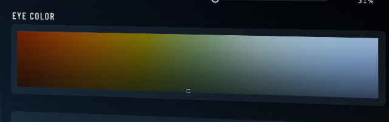

# Star Citizen .chf File Format

Stands for Character Header File. Used for storing character data in Star Citizen.

## File Format

Files are always 4096 bytes long. Any references to "always" should be interpreted as "always in the files I tested with", which were downloaded from star-citizen-characters.com

| Hex indices | size | description                               |
|-------------|------|-------------------------------------------|
| 0x000-0x003 | 4    | sq42 magic bytes (0x42, 0x42, 0x00, 0x00) |
| 0x004-0x007 | 4    | ~CRC32 checksum of data[16..]             |
| 0x008-0x00B | 4    | Compressed data size, int32               |
| 0x00C-0x00F | 4    | Decompressed data size, int32             |
| 0x010-0x013 | 4    | Zstd magic bytes (0x28, 0xB5, 0x2F, 0xFD) |
| 0x014-0xFF7 | 4072 | Data. Encrypted, then zstd compressed     |
| 0xFF8-0xFFF | 8    | Footer. More info below.                  |

### Footer

Perhaps the footer is a save date of some sort. Given the same character data, the footer changes. of course, this makes the crc also change.
Finding the purpose of the footer would be good. As far as I can tell, it is not compressed.
The first byte is always 0xF8, the last two are always 0x00.

## Encryption

Any information in this section is based on the decompressed data. It has nothing to do with the above table.

The following bytes are always the same in all files I tested with:

Common indices:
`
0x00, 0x01, 0x02, 0x03, 0x04, 0x05, 0x06, 0x07, 0x18, 0x19, 0x1A, 0x1B, 0x1C, 0x1D, 0x1E, 0x1F,
0x20, 0x21, 0x22, 0x23, 0x24, 0x25, 0x26, 0x27, 0x28, 0x29, 0x2A, 0x2B, 0x2C, 0x2D, 0x2E, 0x2F,
0x30, 0x31, 0x32, 0x33, 0x3B, 0x3C, 0x3D, 0x3E, 0x3F, 0x40, 0x41, 0x42, 0x43, 0x44, 0x45, 0x47,
0x4B, 0x4F, 0x53, 0x57, 0x5B, 0x5F, 0x63, 0x67, 0x6B, 0x6F, 0x73, 0x77, 0x7B, 0x7F, 0x83, 0x87,
0x8B, 0x8F, 0x93, 0x97, 0x9B, 0x9F, 0xA3, 0xA7, 0xAB, 0xAF, 0xB3, 0xB7, 0xBB, 0xBF, 0xC3, 0xC7,
0xCB, 0xCF, 0xD3, 0xD7, 0xDB, 0xDF, 0xE3, 0xE7, 0xEB, 0xEF, 0xF3, 0xF7, 0xFB, 0xFF, 0x103, 0x107,
0x109, 0x10A, 0x10B, 0x10C, 0x10D, 0x10E, 0x10F, 0x110, 0x111, 0x112, 0x113, 0x114, 0x115, 0x116,
0x117, 0x118, 0x119, 0x11A, 0x11B, 0x11C, 0x11D, 0x11E, 0x11F, 0x120, 0x121, 0x122, 0x123, 0x124,
0x125, 0x126, 0x127, 0x128, 0x129, 0x12A, 0x12B, 0x12C, 0x12D, 0x12E, 0x12F, 0x130, 0x131, 0x132,
0x133, 0x134, 0x135, 0x136, 0x137, 0x138, 0x139, 0x13A, 0x13B, 0x13C, 0x13D, 0x13E, 0x13F, 0x141,
0x142, 0x143, 0x144, 0x145, 0x146, 0x147, 0x148, 0x149, 0x14A, 0x14B, 0x14C, 0x14D, 0x14E, 0x14F,
0x150, 0x151, 0x152, 0x153, 0x154, 0x155, 0x156, 0x157, 0x158, 0x159, 0x15A, 0x15B, 0x15C, 0x15D,
0x15E, 0x15F, 0x160, 0x161, 0x162, 0x163, 0x164, 0x165, 0x166, 0x167, 0x179, 0x17A, 0x17B, 0x17C,
0x17D, 0x17E, 0x17F, 0x194, 0x195, 0x196, 0x197, 0x199, 0x19A, 0x19B, 0x48D, 0x49B, 0x4A2, 0x4B0
`

Values at common indices:
`
0x02, 0x00, 0x00, 0x00, 0x07, 0x00, 0x00, 0x00, 0x00, 0x00, 0x00, 0x00, 0x00, 0x00, 0x00, 0x00,
0x00, 0x00, 0x00, 0x00, 0x00, 0x00, 0x00, 0x00, 0xD8, 0x00, 0x00, 0x00, 0x00, 0x00, 0x00, 0x00,
0x94, 0x93, 0xD0, 0xFC, 0x65, 0x00, 0x00, 0x00, 0x00, 0x0C, 0x00, 0x04, 0x00, 0x04, 0x00, 0x00,
0x00, 0x00, 0x00, 0x00, 0x00, 0x00, 0x00, 0x00, 0x00, 0x00, 0x00, 0x00, 0x00, 0x00, 0x00, 0x00,
0x00, 0x00, 0x00, 0x00, 0x00, 0x00, 0x00, 0x00, 0x00, 0x00, 0x00, 0x00, 0x00, 0x00, 0x00, 0x00,
0x00, 0x00, 0x00, 0x00, 0x00, 0x00, 0x00, 0x00, 0x00, 0x00, 0x00, 0x00, 0x00, 0x00, 0x00, 0x00,
0x00, 0x00, 0x00, 0x00, 0x00, 0x00, 0x00, 0xAC, 0x41, 0x63, 0xAB, 0x04, 0x41, 0x5F, 0x75, 0x7D,
0x8A, 0xAA, 0xDB, 0xF6, 0x76, 0x1E, 0xFD, 0x58, 0x7B, 0x24, 0x8B, 0x01, 0x00, 0x00, 0x00, 0x00,
0x00, 0x00, 0x00, 0xB9, 0x0D, 0x01, 0x47, 0x50, 0x45, 0x80, 0xBF, 0xB3, 0xFA, 0x5C, 0x1D, 0x6E,
0x08, 0xA7, 0x96, 0xE8, 0x39, 0xAB, 0xB4, 0x00, 0x00, 0x00, 0x00, 0x00, 0x00, 0x00, 0x50, 0x55,
0xBB, 0xC5, 0x71, 0x48, 0x60, 0xE1, 0x63, 0xA3, 0x4C, 0x6B, 0x10, 0x03, 0xB4, 0x67, 0x74, 0xE4,
0x09, 0xB7, 0x00, 0x00, 0x00, 0x00, 0x00, 0x00, 0x00, 0x00, 0x95, 0x1A, 0x60, 0x13, 0x00, 0x00,
0x00, 0x00, 0x00, 0x00, 0x00, 0x00, 0x00, 0x00, 0x00, 0x00, 0x00, 0x00, 0x00, 0x00, 0x00, 0x00
`

Ranges:
`
0x0000-0x0007, 0x0018-0x0033, 0x003B-0x0045, 0x0047-0x0047, 0x004B-0x004B, 0x004F-0x004F, 0x0053-0x0053, 0x0057-0x0057,
0x005B-0x005B, 0x005F-0x005F, 0x0063-0x0063, 0x0067-0x0067, 0x006B-0x006B, 0x006F-0x006F, 0x0073-0x0073, 0x0077-0x0077,
0x007B-0x007B, 0x007F-0x007F, 0x0083-0x0083, 0x0087-0x0087, 0x008B-0x008B, 0x008F-0x008F, 0x0093-0x0093, 0x0097-0x0097,
0x009B-0x009B, 0x009F-0x009F, 0x00A3-0x00A3, 0x00A7-0x00A7, 0x00AB-0x00AB, 0x00AF-0x00AF, 0x00B3-0x00B3, 0x00B7-0x00B7,
0x00BB-0x00BB, 0x00BF-0x00BF, 0x00C3-0x00C3, 0x00C7-0x00C7, 0x00CB-0x00CB, 0x00CF-0x00CF, 0x00D3-0x00D3, 0x00D7-0x00D7,
0x00DB-0x00DB, 0x00DF-0x00DF, 0x00E3-0x00E3, 0x00E7-0x00E7, 0x00EB-0x00EB, 0x00EF-0x00EF, 0x00F3-0x00F3, 0x00F7-0x00F7,
0x00FB-0x00FB, 0x00FF-0x00FF, 0x0103-0x0103, 0x0107-0x0107, 0x0109-0x013F, 0x0141-0x0167, 0x0179-0x017F, 0x0194-0x0197,
0x0199-0x019B, 0x048D-0x048D, 0x049B-0x049B, 0x04A2-0x04A2, 0x04B0-0x04B0
`

| Indices                | size | data                   | description            |
|------------------------|------|------------------------|------------------------|
| 0x00, 0x01, 0x02, 0x03 | 4    | 0x02, 0x00, 0x00, 0x00 | Unknown1               |
| 0x04, 0x05, 0x06, 0x07 | 4    | 0x07, 0x00, 0x00, 0x00 | CHF version. See below |
| 0x08 - 0x17            | 16   | 0x??                   | Unknown2               |
| 0x18 - 0x27            | 16   | 0x00                   | Padding                |

Unknown1:
I tried changing the 2 value to 1 and 3, this makes the game silently fail to load the character.

CHF version:
When changing the number in the file to 0x08, this is shown in the log:
`[Error] <Unrecognised Custom Head File Version: %u> assert(false): Unrecognised Custom Head File Version: 8 [Team_S42Features][Assert]`

## Binary Protocol

### Eye color

The game has this color picker:

